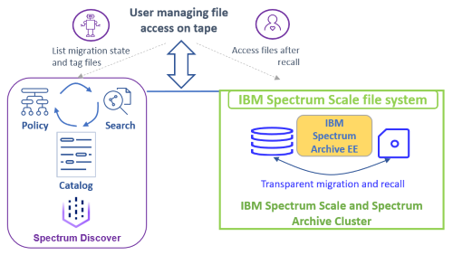

## Introduction

This set of program examples accomodates workflows for tape optimized recalls of files using the metadata management capabilities of IBM Spectrum Discover. 

The solution where these progam examples are used is shown in the figure below:



Files are stored in an IBM Spectrum Scale file system that is space managed by IBM Spectrum Archive Enterprise Edition. The user can see and access files, except for migrated files. Accessing migrated files requires interaction with the metadata management system provided by IBM Spectrum Discover. 

IBM Spectrum Discover catalogs the metadata for files stored in the IBM Spectrum Scale file system, including the migration state for files. Furthermore, IBM Spectrum Discover allows adding custom tags for files that are migrated and must be recalled in a tape optimized manner. This gives the user to ability to see the migration state and tag files to be recalled. 

The program examples in the repository use the IBM Spectrum Discover REST APIs. 

For more information about the solution refer to this [article](tbd). 


### License
This project is under [MIT license](LICENSE.txt).


## Workflow

The following workflow can be accomodated using the programming examples in this repository. These programming examples use the IBM Spectrum Discover REST APIs. 

1. The user can query the IBM Spectrum Discover metadata catalog to determine the migration state of files, using the [lstag.sh](lstag.sh) program. 

2. When the user requires access to migrated files, then he can add a custom recall tag to the files in the IBM Spectrum Discover metadata catalog, using the [ftag.sh](ftag.sh) program.

3. The scheduled [recallTagged.sh](scancol.sh) program periodically queries the IBM Spectrum Discover metadata catalog for files that are migrated and have the custom recall tag set. With this query the scheduled process composes a list of files that must be recalled and invokes the IBM Spectrum Archive Enterprise Edition tape optimized recall function. This process must be scheduled and executed on an IBM Spectrum Archive Enterprise Edition server. 

4. Once the recall is completed the scheduled [scancol.sh](scancol.sh) scans the IBM Spectrum Scale data source to update the migration status of all files. Furthermore, it updates the collection containing the set of files that are space managed by IBM Spectrum Archive Enterprise Edition. And it resets the custom recall for those files that are no longer migrated. 

To accomodate this workflow, the solution must be deployed and prepared. 


## Preparation

The following preparation steps must be performed in the IBM Spectrum Discover server to accomodate the workflow. In each step some configuration variables must be recorded: 

1. Add the IBM Spectrum Scale data source and record the `data source name` and `file system name`.

2. Create a collection with a policy that includes the partition of the file system that is space managed. The partition can be the entire file system with some exclusions or it can be a fileset that is space managed. Record the `collection name`. 

3. Create a custom tag that is used to tag files for recall. Record the `tag name` and `tag value`. 

5. Optionally, create an IBM Spectrum Discover user with the role Data Admin. Record the `data admin username` and the `data admin user password`.

Once these steps are completed, the program examples can be installed and configured. 


## Installation and configuration

Clone this repository: 

```
# git clone git@github.ibm.com:nils-haustein/SpectrumDiscover-TapeRecall.git
``` 

Enter the configuration variables that were create in the preparation step above in the file [configParms.rc](configParms.rc). The configuration parameters defined in this file are sourced in all other program examples: 

| Parameter | Description |
| ----------|-------------|
| sdServer | IP alias or address of the IBM Spectrum Discover server |
| sdUser   | `data admin username` of the Data Admin user that was created in the IBM Spectrum Discover server |
| sdPasswd | `data admin user password` of the Data Admin user that was created in the IBM Spectrum Discover server |
| sdDb     | Name of the IBM Spectrum Discover data base. The DB-name `metaocean` is default. |
| collName | `collection name` that was created in the IBM Spectrum Discover server and that represents the metadata records for the space managed file system partition. |
| tagName  | `tag name` of the custom tag that was created in the IBM Spectrum Discover server and that is used to tag files for recall. The default tag name is `recallMe`. |
| tagValue | `tag value` of the custom tag that was created in the IBM Spectrum Discover server and that is used to tag files for recall. The default tag value is `true`, indicating that the file must be recalled|


Get familiar with the programm examples below. 


## Programm examples reference


### [lstag.sh](lstag.sh) - display migration status and tags

This program allows the user to display the migration state and the value of the tag `recallMe` for a given path and file name specification. It queries the IBM Spectrum Discover metadata catalog with the filter provided by the user. The filter is a path and file name specification and can either be a fully qualified path name or a fully qualified file name. Wildcards are not currently supported. 

The example below shows the selected metadata fields for file in path /ibm/fs1/discover1/test1:

```shell
# lstag.sh /ibm/fs1/discover1/test1
State  Size    recallMe Collection       Path-and-Filename
------ ------- -------- ----------       -------------------
migrtd 857088  true    archivecollection /ibm/fs1/discover1/test1/file_8.pdf
migrtd 788480  true    archivecollection /ibm/fs1/discover1/test1/file_9.pdf
migrtd 236550  true    archivecollection /ibm/fs1/discover1/test1/file_0.pdf
premig 848896  false   archivecollection /ibm/fs1/discover1/test1/file_1.pdf
migrtd 290816  true    archivecollection /ibm/fs1/discover1/test1/file_2.pdf
premig 599040  false   archivecollection /ibm/fs1/discover1/test1/file_3.pdf
migrtd 386048  true    archivecollection /ibm/fs1/discover1/test1/file_4.pdf
migrtd 795648  true    archivecollection /ibm/fs1/discover1/test1/file_5.pdf
migrtd 644096  true    archivecollection /ibm/fs1/discover1/test1/file_6.pdf
migrtd 117760  true    archivecollection /ibm/fs1/discover1/test1/file_7.pdf
``` 


### [ftag.sh](ftag.sh) - set the recallMe tag to true

This program allows the user to tag metadata records for a given path and file name specification with the tag recallMe=true. It updates and executes an auto-tagging policy in the IBM Spectrum Discover server that adds the tag `recallMe=true` to metadata records matching the path and file name specification and where the state is migrated. The user provided path and file name specification and can either be a fully qualified path name or a fully qualified file name. Wildcards are not currently supported.

In the example the file /ibm/fs1/discover1/test1/file_1.pdf is tagged with the recallMe=true tag. Before the tag is added, the state of the file is the following in IBM Spectrum Discover:

```shell
# lstag.sh /ibm/fs1/discover1/test1/file_1.pdf
State  Size    recallMe Collection          Path-and-Filename
-----  ------- -------- ----------          -----------------
migrtd 848896  false    archivecollection  /ibm/fs1/discover1/test1/file_1.pdf
```

Adding the tag:

```shell
# ftag.sh /ibm/fs1/discover1/test1/file_1.pdf
Info: checking if tag recallMe exists.
Info: creating and executing policy to tag the files
```

Finally, check the state again. The tag was successfully added:

```shell
# lstag.sh /ibm/fs1/discover1/test1/file_1.pdf
State  Size    recallMe Collection         Path-and-Filename
-----  ------- -------- ----------         -----------------
migrtd 848896  true     archivecollection  /ibm/fs1/discover1/test1/file_1.pdf
```


### [recallTagged.sh](recallTagged) - recall tagged files

This program queries the metadata catalog for files in a specified collection that have the tag `recallMe` set to `true` and recalls these files. This program must run on an IBM Spectrum Archive server because it uses the `eeadm recall` command. The collection is provided as input parameter by the user. 

The example below recalls all tagged files in the `archivecollection`:

```shell
# recallTagged.sh archivecollection
Info: Checking configuration parameters.
Info: obtaining file list from Spectrum Discover.
Info: recalling 10 files.
2021-12-31 10:33:51 GLESL268I: 10 file name(s) have been provided to recall.
2021-12-31 10:33:54 GLESL839I: All 10 file(s) has been successfully processed.
```

This program is not intended for use by the user of the file system. It is an administrative program that the administrator of the IBM Spectrum Archive EE system should use. This program can be scheduled to run in certain intervals. 

Note, after recalling files using IBM Spectrum Archive EE, the metadata records in the IBM Spectrum Discover catalog are not automatically updated. An additional program is used to update the catalog. 


### [scancol.sh](scancol.sh) - Update metadata catalog

This program updates the IBM Spectrum Discover catalog for a specified data source and collection. It first scans the data source provided by the user as input parameter. Then it runs the collection policy for the collection provided by the user as input parameter. Finally,  it runs a auto-tagging policy that sets the `recallMe` tag to `false` for all files that are not migrated in the collection. 

The example below shows how to run this program for the data source name `archive` and the collection `archivecollection` (both created during preparation):

```shell
# scancol.sh archive archivecollection
Info: Checking configuration parameters.
--------------------------------------------------------------------
Info: checking and scanning data source connection archive
Info: Data source connection archive exists, scanning it.
Info: status: Complete
--------------------------------------------------------------------
Info: checking if collection policy exists.
Info: Collection policy archivecollection_tagpolicy exists, starting it.
Info: status: complete
---------------------------------------------------------------------
Info: checking if policy to remove tag recallMe exists.
Info: Starting policy recallMeNot-policy to remove the tag recallMe.
Info: status: complete
```

After running the program `scancol.sh`, the tags state and `recallMe` were adjusted as show in the `lstag.sh` output below: 

```shell
# lstag.sh /ibm/fs1/discover1/test1
State  Size    recallMe Collection       Path-and-Filename
------ ------- -------- ----------       -------------------
premig 857088  false    archivecollection /ibm/fs1/discover1/test1/file_8.pdf
premig 788480  false    archivecollection /ibm/fs1/discover1/test1/file_9.pdf
premig 236550  false    archivecollection /ibm/fs1/discover1/test1/file_0.pdf
premig 848896  false    archivecollection /ibm/fs1/discover1/test1/file_1.pdf
premig 290816  false    archivecollection /ibm/fs1/discover1/test1/file_2.pdf
premig 599040  false    archivecollection /ibm/fs1/discover1/test1/file_3.pdf
premig 386048  false    archivecollection /ibm/fs1/discover1/test1/file_4.pdf
premig 795648  false    archivecollection /ibm/fs1/discover1/test1/file_5.pdf
premig 644096  false    archivecollection /ibm/fs1/discover1/test1/file_6.pdf
premig 117760  false    archivecollection /ibm/fs1/discover1/test1/file_7.pdf
```

This program is not intended for use by the user of the file system. It is an administrative program that the administrator of the IBM Spectrum Archive EE system should use. This program can be scheduled to run in certain intervals, perhaps it may be executed right after the tape optimized recall. 

